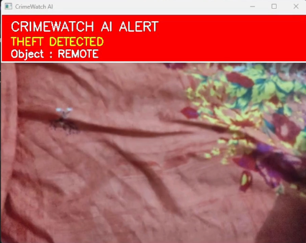
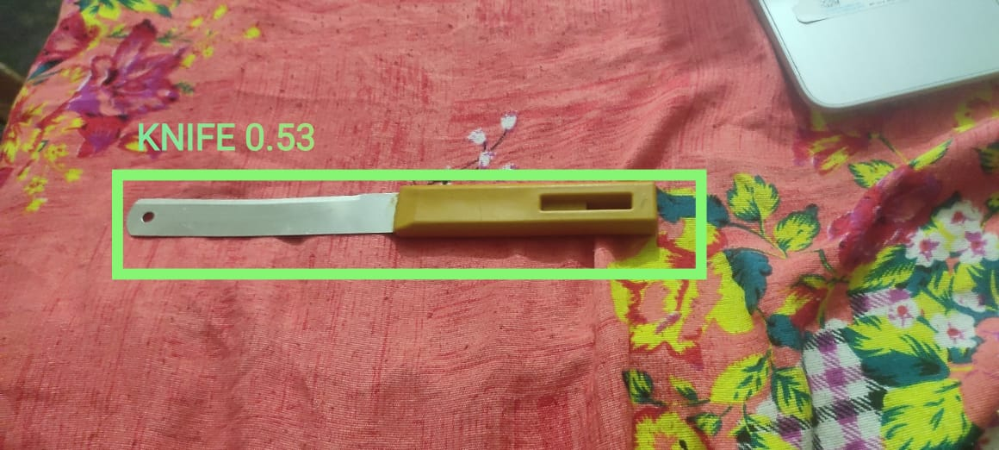

# 🚨 CrimeWatch AI

> **AI-powered real-time surveillance system built with Python, OpenCV, and YOLOv8.**

CrimeWatch AI monitors live camera footage, detects suspicious events, automatically captures evidence, and maintains timestamped crime logs.

---

## ✨ Current Features

- 🔍 Real-Time Object Detection
- 🚨 Theft Detection
- 🔪 Dangerous Object Detection
- 📸 Automatic Evidence Capture
- 📝 Crime Logging

---

## 🔍 Real-Time Object Detection

- Detects multiple objects using YOLOv8.
- Displays confidence scores and bounding boxes.

---

## 🚨 Theft Detection

- Monitors valuable objects continuously.
- Detects when an object disappears after being visible.
- Generates an instant theft alert.

---

## 🔪 Dangerous Object Detection

- Detects dangerous objects such as:
  - Scissors
  - Baseball Bat
  - Knife *(when supported by the model)*
- Triggers a real-time warning alert.

---

## 📸 Automatic Evidence Capture

- Saves screenshots automatically when an event is detected.
- Stores evidence with timestamps.

---

## 📝 Crime Logging

- Records all detected events in `crime_log.txt`.
- Maintains a timestamped history of incidents.

---

## 🛠️ Tech Stack

- Python
- OpenCV
- YOLOv8
- Ultralytics

---
# 📸 Screenshots

### 🔍 Real-Time Object Detection

The system detects objects in real time using YOLOv8 and displays labels with confidence scores.

### 🚨 Theft Detection

When a monitored object disappears after being visible, CrimeWatch AI generates a theft alert and automatically captures evidence.

### 🔪 Dangerous Object Detection

The system detects dangerous objects such as knives, scissors, and baseball bats, then generates an instant warning alert.

## 🎯 Vision

Think of CrimeWatch AI as a **digital security guard**.

- 👁️ Camera → Eyes
- 🧠 YOLOv8 → Perception Engine
- 📸 Evidence System → Memory
- 📝 Logs → Incident History

The goal is not just to detect objects, but to build an intelligent surveillance system capable of understanding and responding to suspicious events in real time.

